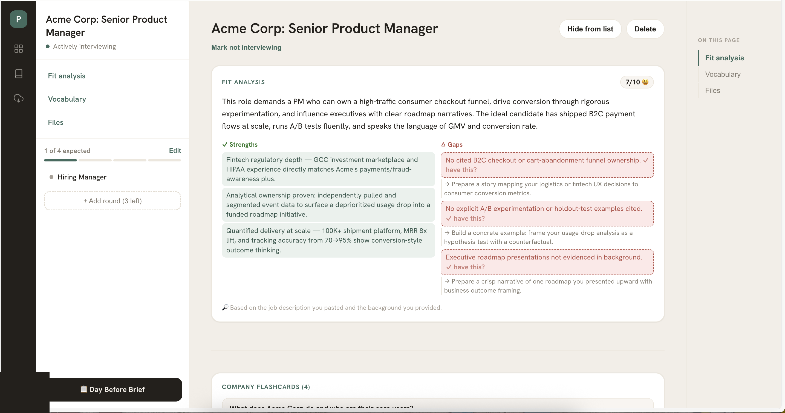
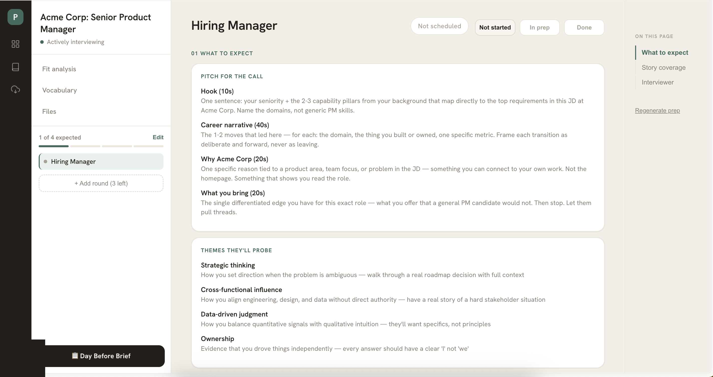
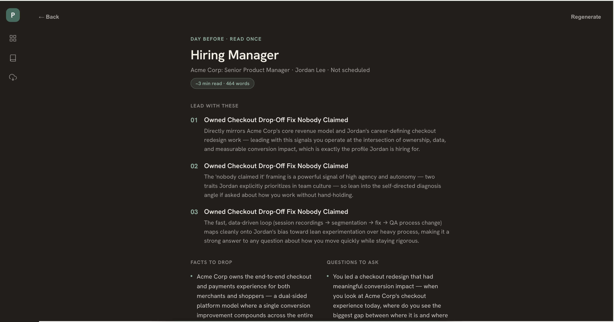

# Pitch

Round-specific interview prep that compounds across every job. Paste a job description, get a fit analysis and tailored prep for every interview stage, research your interviewer, build a reusable STAR story bank, and generate a day-before brief pulling it all together.

Runs entirely on your own accounts — your own Supabase project, your own Anthropic API key. Nothing here talks to anyone else's account or server. Free to self-host; see [License](#license) if you're thinking about anything commercial.

> [!WARNING]
> **If you deploy this anywhere public, read [Before you deploy this anywhere public](#before-you-deploy-this-anywhere-public) first.** One shared API key pays for every generation call — an open deployment is an open invitation to spend your Anthropic budget.

## Scope

This is built for **Product Manager and Software Engineer interview loops** — you pick a track at campaign creation, and round types plus the competency taxonomy behind every generated prep doc (`src/lib/constants.ts`) are keyed per track. PM gets rounds like Product Sense and Analytical Thinking; SWE gets Coding and System Design in their place. It is not a general-purpose interview prep tool for arbitrary roles outside these two tracks — a role that isn't PM or SWE will still generate prep against whichever track you picked, not role-appropriate content for that role.

## Screenshots

| Fit analysis | Round prep |
|---|---|
|  |  |

**Day Before Brief** — a full-ink takeover pulling your top stories, company facts, interviewer notes, and questions to ask into one page:



## What it costs to run

Measured from a real campaign run (Claude Sonnet, at $3/MTok input · $15/MTok output — check [anthropic.com/pricing](https://www.anthropic.com/pricing) for current rates):

| Campaign size | Claude API cost |
|---|---|
| 4 rounds, 1 story captured per round | ~$0.16 |
| 6 rounds | ~$0.22 |
| 7 rounds (max) | ~$0.26 |

That's the entire cost of running this — no subscription, no hosting fee, no Supabase/Vercel paid tier required (both have free tiers that comfortably cover personal use). A full job search with several campaigns running in parallel is still well under a dollar in AI spend.

## Stack

- [Next.js](https://nextjs.org) (App Router) + React + TypeScript
- [Supabase](https://supabase.com) — auth (Google OAuth + email/password) and data (Postgres + Storage)
- [Claude](https://www.anthropic.com/claude) (Anthropic API) for generation

## Running it yourself

**Time to first run: ~15 minutes**, most of it waiting on Supabase/Google Cloud dashboards rather than typing. That means running this locally (or deploying your own copy) needs a bit of one-time setup before it works. None of it is optional; skipping a step just means that piece silently doesn't work.

### 1. Clone and install

```bash
git clone <this-repo-url>
cd pitch
npm install
```

### 2. Create a Supabase project

Free tier is enough. Create one at [supabase.com/dashboard](https://supabase.com/dashboard).

### 3. Set up the database

In your Supabase project → **SQL Editor**, run [`supabase/schema.sql`](supabase/schema.sql). This creates the `campaigns` and `stories` tables with row-level security, so each user can only ever see their own data.

### 4. Set up file storage

Follow the steps in [`supabase/storage-setup.sql`](supabase/storage-setup.sql) — create a private `campaign-files` bucket (via the dashboard or the SQL included there), then run the RLS policy in that file. This powers per-campaign file uploads.

### 5. Enable Google sign-in

In Supabase: **Authentication → Providers → Google**, toggle it on. You'll need a Google OAuth client ID/secret — create one for free at the [Google Cloud Console](https://console.cloud.google.com/apis/credentials) (OAuth consent screen + OAuth client ID, type "Web application"). Supabase's own provider page shows you the exact redirect URI to paste into the Google Cloud client's "Authorized redirect URIs."

Also add your app's URLs to Supabase's **Authentication → URL Configuration → Redirect URLs**: both `http://localhost:3000/auth/callback` for local dev and your production domain's equivalent once deployed.

Email/password sign-in also works out of the box with no extra setup — useful for a personal test account without going through Google at all (Authentication → Users → Add User in the Supabase dashboard, with "Auto Confirm User" on).

### 6. Get an Anthropic API key

Create one at [console.anthropic.com](https://console.anthropic.com). This is the key that pays for every generation — see the cost note below before deploying anywhere public.

### 7. Configure environment variables

```bash
cp .env.local.example .env.local
```

Fill in the three required values (Supabase URL, Supabase anon key, Anthropic API key). `ALLOWED_EMAILS` is optional — see below.

### 8. Run it

```bash
npm run dev
```

Open `http://localhost:3000`.

## Before you deploy this anywhere public

Every AI generation call in this app runs through the single `ANTHROPIC_API_KEY` you configure — it's a per-deployment key, not a per-user one. That means **anyone who can sign in to your deployment can spend your Anthropic budget**, and Google OAuth doesn't restrict sign-in to specific accounts by default. If you deploy this and the URL becomes public or discoverable, you're exposed until you do something about it.

The fix: set `ALLOWED_EMAILS` (comma-separated) in your deployment's environment variables. Only those emails will be able to trigger generation — everyone else can still sign in and look around, but every generation request gets rejected before it reaches Anthropic. Leave it unset only while your deployment URL is genuinely private.

## License

[PolyForm Noncommercial 1.0.0](LICENSE) — free to run, modify, and share for any non-commercial purpose, including personal use, self-hosting, and job hunting. If you want to build something commercial on top of this (a paid product, a hosted service, etc.), that needs a separate license — [open an issue](../../issues/new) or email [apoorv.jdeshmukh@gmail.com](mailto:apoorv.jdeshmukh@gmail.com) to talk terms.
